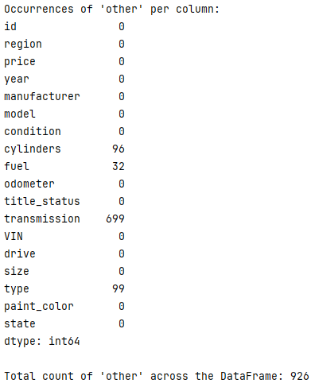

<h1 style="text-align: center; color: Purple;">What drives a used car price?</h1>

This Python application using Jupyter Notebook explores a dataset containing information of 430,000 people in order to determine which factors make them accept a driving coupon.

<a href="https://github.com/Balu-A/UsedCarPriceDrivers/blob/main/Used%20Car%20Price%20Drivers.ipynb" target="_blank">Jupiter Notebook used</a>

 The current CRISP-DM Process Model for Data Mining (see Figure 1) was followed.

<h4 align="center"> Figure 1</h4>

<h2>Business Understanding</h2>
From a business perspective, we are tasked with identifying key drivers for used car prices.  In the CRISP-DM overview, we are asked to convert this business framing to a data problem definition.  Using a few sentences, reframe the task as a data task with the appropriate technical vocabulary. 

<ol style="font-family: Arial;font-size: 16px;">
    <li style="color:Blue"> Tasks Involved:</li>
    <ul>
        <li style="color:Blue"> Develop a predictive modeling framework to estimate used car prices based on a variety of features.</li>
        <li style="color:Blue"> Perform exploratory data analysis to identify potential predictors of car prices, such as make, model, year, mileage, and condition.</li>
        <li style="color:Blue"> Construct a regression model that can quantify the impact of these features on the car's price. Key tasks include feature selection, model training, and validation to ensure the model accurately captures the relationship between car attributes and their market values.</li>
        <li style="color:Blue"> Pinpoint the most influential factors affecting used car prices and provide actionable insights for pricing strategies.</li>
    </ul>
</ol>

<h2>Data Understanding</h2>
After considering the business understanding, we want to get familiar with our data.  Write down some steps that you would take to get to know the dataset and identify any quality issues within.  Take time to get to know the dataset and explore what information it contains and how this could be used to inform your business understanding.

 
<ol style="font-family: Arial;font-size: 16px;">
    <li style="color:Blue">  Data Exploration: </li>
    <ul>
        <li style="color:Blue"> Begin by examining the structure of the dataset. How many columns and rows does it contain?</li>
        <li style="color:Blue"> Print out the first few rows of the dataset to get a sense of what the data looks like.</li>
        <li style="color:Blue"> Check the data types of each column. Are they numerical, categorical, or date-time?</li>
        <li style="color:Blue"> Look for any missing values in the dataset. How prevalent are they, and how might they affect your analysis?</li>
    </ul>
    <li style="color:Blue">  Column Analysis: </li>
    <ul>
        <li style="color:Blue"> Examine the unique values in categorical columns. Are there any unexpected or invalid values?</li>
        <li style="color:Blue"> For numerical columns, check for outliers. Are there any values that seem unreasonable or far from the central tendency of the data?</li>
        <li style="color:Blue"> Check for consistency in date-time columns. Are all dates formatted correctly, and do they fall within expected ranges?</li>
    </ul>
    <li style="color:Blue">  Data Quality Assessment: </li>
    <ul>
        <li style="color:Blue"> Assess the completeness of the dataset. Are there any columns with a high proportion of missing values?</li>
        <li style="color:Blue"> Look for duplicates in the dataset. Are there any rows that are exact duplicates or nearly identical duplicates?</li>
    </ul>
    <li style="color:Blue">  Visualization: </li>
    <ul>
        <li style="color:Blue"> Create visualizations such as histograms, box plots, or scatter plots to explore the relationships between variables and identify any patterns or trends.</li>
        <li style="color:Blue"> Visualize missing data patterns to understand if there are any systematic issues with missing values.</li> 
    </ul> 

<h2>Data Preparation</h2>

1. A quick examination using DF.INFO yielded 
results that show **null data** across some features. 
 

<h4 align="center"> Figure 2</h4>

Nulls per column:

<h4 align="center"> Figure 3</h4>

2. Also, there is "**other**" value across multiple categorical features. This could potentially
create an issue when the categorical features are encoded. So, it makes sense to rename these
values according to feature. The list below shows the columns that have "other" values.

<h4 align="center"> Figure 4</h4>

3. Upon inspection, there are **no duplicate rows** in the 
dataframe.

4. Next up, all the **categorical** features were encoded using 'Target encoding' technique.
A correlation heatmap was developed to understand the strength between dependent
and independent variables.

<h4 align="center"> Figure 5</h4>

5. In order to build effective models, some of the 
low-importance features were **dropped** from the dataframe.

<strong>['id','region','title_status','VIN','paint_color','state','model']</strong>

6. A close examination of the dataset reveals that
there are a lot of **outliers**. The below bar plot shows that Year and Price have huge outliers. 
These need to treated using **Interquartile Range [IQR]** technique.

<h4 align="center"> Figure 6</h4>

 After removing the outliers, 
this is the range of the numerical features:
 
(a) Lower limit for price is 0 and the upper limit is 45259
 
(b) Lower limit for odometer is 0 and the upper limit is 255000
 
(c) Lower limit for year is 1998 and the upper limit is 2026

<h2>Data Modeling </h2>

The prediction of output was made using various
set of independent variables/input variables using three linear regression models. The models were: 

   
<strong>(a) Linear Regression [w/ Permutation Importance]</strong>   
<strong>(b) Ridge Regression [w/ GridSearch CV & Permutation Importance]</strong>   
<strong>(c)Lasso Regression [w/ GridSearchCV & SequentialForwardSelection]</strong>

   
Out of the 3 models, the Lasso regression model performed relatively better with 70% of R-Squared error. 
This means that <strong> 70% of the variance in the dependent variable (the variable being predicted) is explained by 
the independent variables (the predictors) used in the model</strong>. This suggests that the model has a good level of 
fit and is able to explain a substantial portion of the observed variability in the outcome. 

<h4 align="center"> Figure 7</h4>

<h2>Findings</h2>

(a) The<strong> most important drivers</strong> depicted by the Lasso 
regression are: 

1. Year    2. Odometer    3. Cylinders   4. Transmission   5. Drivetrain   6. Trim Type
  7. Fuel Injection 

  

<h4 align="center"> Figure 8</h4>

(b) Most used cars cost between $8000 and $10000.  
(c) The years that dominate:

- Low price group are 2006, 2007, and 2008;  
- Medium price group are 2015, 2016, and 2017;  
- High price group are 2017, 2018, and 2019;  

(d) In regard to the engine configuration:

- High price group are <strong>not</strong> 4-cylinder  
- Medium price group are either 6-cylinder or 8-cylinder  
- Low price group are 4-cylinder or 6-cylinder  

<h4 align="center"> Figure 9</h4>

(e) Cars under 50000 miles sell at a high price, decreasing exponentially thereafter. Cars with odometer between 
50000 and 10000 are popular among the low price group. 
(f) Automatic transmission is the most popular among the three price categories. 
(g) Pick-up trucks sell at a high price, while sedans and SUVs are popular in the low price tag.  
<nobr>

<h2>Next Steps and Recommendations</h2>

- Consumers value recent models, so it is recommended that acquiring recent cars (2017 and beyond) is prioritised. Acquiring cars 
made in 2008 and prior should not be a priority  
- Cars made in 2017 and beyond can be listed at higher prices, while cars older than 2008 should be more affordably priced. 
- If the target market for the dealership is high price group, then they should prioritize selling 6-cylinder engine 
configuration cars. For the coupon-clippers, the 4- and 6-cylinder cars are recommended. 
- Lower odometer readings are valued, and efforts to list cars with odometer readings below 50000 miles are recommended. 
Cars with odometer readings above 100000 should not be prioritised, and when listed, they should be more affordably 
priced.  
- Automatic transmission cars are the most popular breed. Avoid listing manual transmission cars at all costs. 
- Consumers in the high price group value pick-up models. So, they can be priced higher. However, SUVs and sedans
are mostly preferred by price-conscious and savvy consumers.

